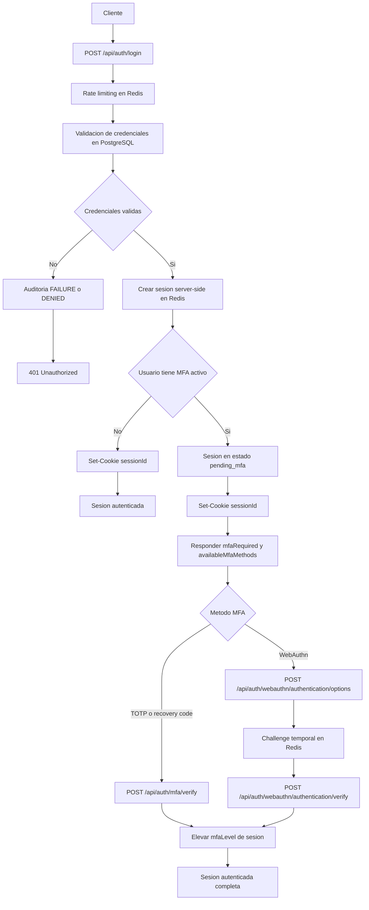
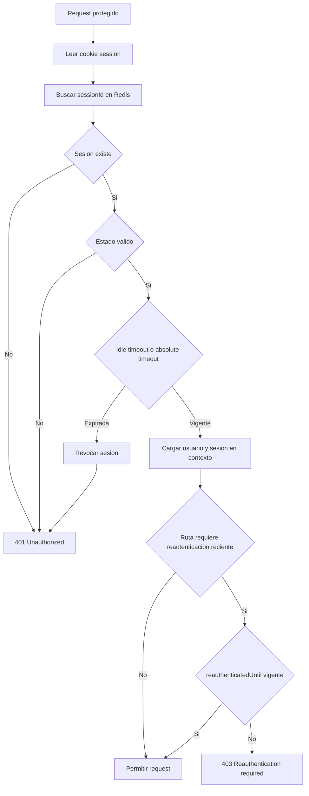
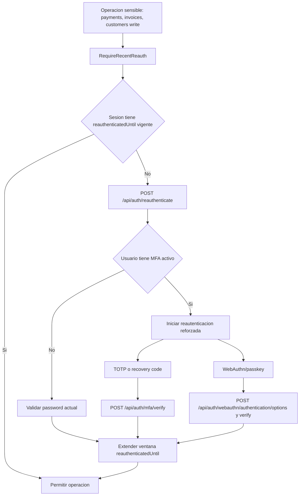
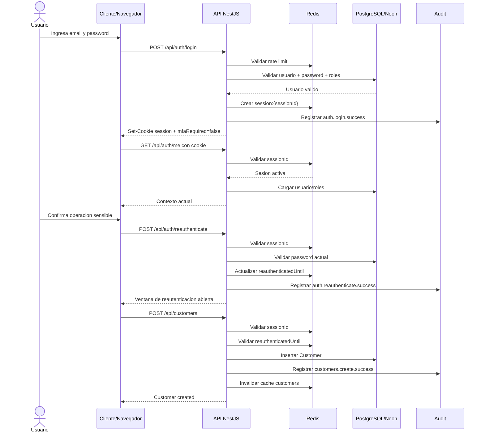
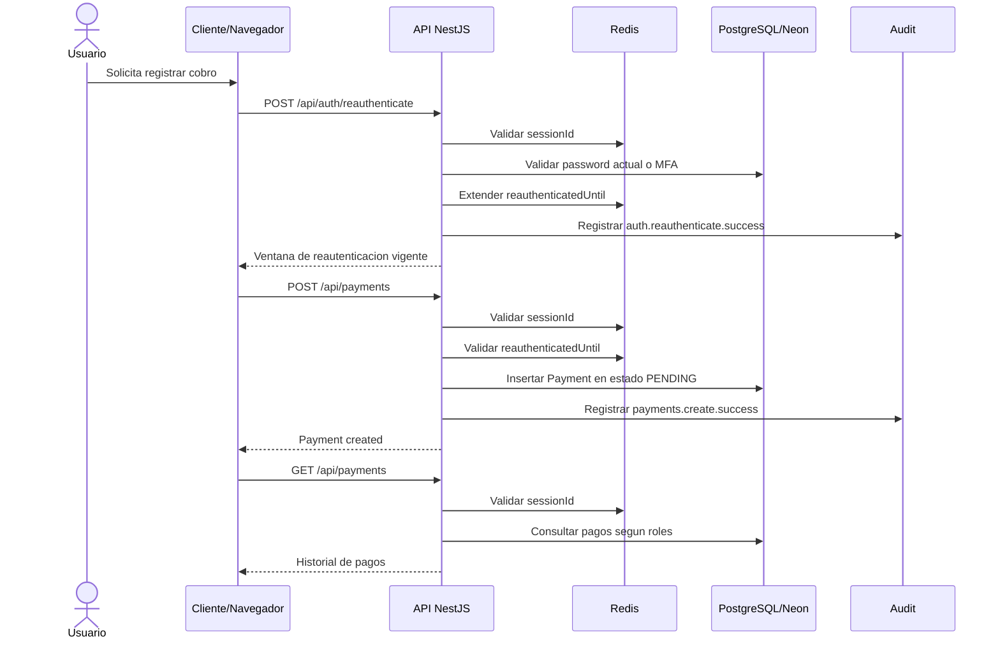
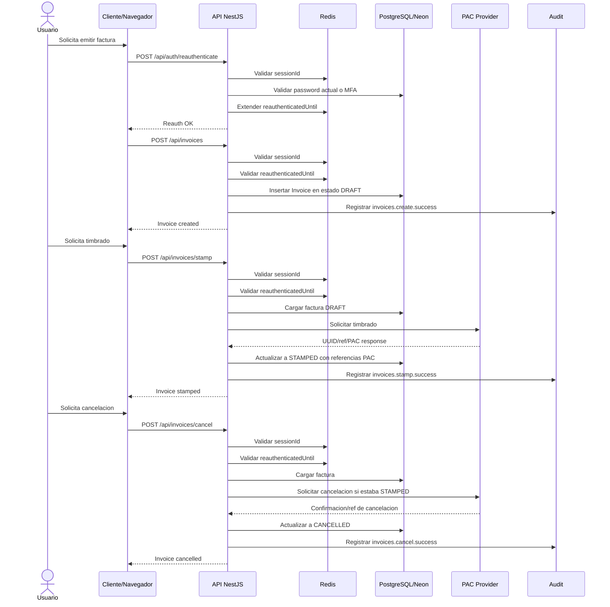

# Arquitectura objetivo

## Vision general

La plataforma debe proteger activos de alto impacto: credenciales, sesiones, operaciones financieras y timbrado fiscal. Para arrancar con bajo costo operativo sin perder orden arquitectonico, la recomendacion es un monolito modular en `NestJS`, preparado para evolucionar a servicios separados.

Flujo principal:

```text
Frontend web
  -> API NestJS
    -> modulo auth
    -> modulo sessions
    -> modulo payments
    -> modulo invoices
    -> modulo audit
      -> PostgreSQL (persistencia durable)
      -> Redis (sesiones activas y datos efimeros)
      -> integraciones externas (banco / PAC)
```

## Estado implementado hoy

La arquitectura objetivo ya esta aterrizada en una API modular con estos bloques activos:

- `auth`: login, MFA, reautenticacion, recovery codes, rate limiting
- `sessions`: store de sesiones, revocacion, rotacion, listados
- `payments`: creacion y consulta de pagos con auditoria durable
- `invoices`: creacion, timbrado y cancelacion con proveedor PAC abstracto
- `audit`: persistencia de eventos criticos y politicas fail-closed
- `health`: liveness, readiness y modo degradado

Referencia util para el modelo actual:

- `docs/data-model-and-crud-guide.md`

## Flujo real de autenticacion

1. El cliente envia email y password a `POST /api/auth/login`.
2. La API valida rate limiting por correo e IP en `Redis`.
3. La API valida credenciales en `PostgreSQL`.
4. Si el usuario esta activo, crea una sesion server-side en `Redis`.
5. La sesion se devuelve al navegador via cookie segura.
6. Si el usuario tiene MFA, la sesion queda pendiente hasta `POST /api/auth/mfa/verify`.

## Diagrama de autenticacion, sesion y MFA



Lectura del diagrama:

- `PostgreSQL` valida identidad durable
- `Redis` guarda la sesion activa y los challenges temporales
- la cookie del navegador solo apunta al `sessionId`
- si hay MFA, la sesion existe pero queda parcial hasta completar el segundo factor
- el backend decide siempre si la sesion sigue valida; el frontend no es la fuente de verdad

## Flujo real de sesion

1. Cada request protegida lee la cookie de sesion.
2. La API valida la sesion en `Redis`.
3. Se revisan estado, expiracion idle y expiracion absoluta.
4. Si la sesion sigue valida, se actualiza `lastActivity`.
5. Si la operacion exige reautenticacion reciente, se valida la ventana `reauthenticatedUntil`.

## Diagrama de vida de la sesion



Notas:

- `Redis` es la fuente de verdad para la sesion activa
- si `Redis` no confirma la sesion, la ruta protegida falla cerrada
- `refresh` rota sesion de forma segura sin exponer tokens al frontend

## Flujo real de MFA

1. `POST /api/auth/mfa/setup` crea un secreto TOTP temporal en `Redis`.
2. `POST /api/auth/mfa/verify` valida TOTP o recovery code.
3. Si el enrolamiento es correcto, el usuario queda con MFA habilitado y recovery codes en `PostgreSQL`.
4. Los intentos fallidos de MFA disparan throttling y lockout temporal.

## Diagrama de reautenticacion critica



Notas:

- crear, editar y borrar `customers` exige este flujo
- `payments` e `invoices` tambien dependen de reautenticacion reciente
- con MFA activo, password sola ya no es suficiente para reautenticar operaciones sensibles

## Secuencia: login -> sesion -> reauth -> create customer



Lectura paso a paso:

1. El usuario inicia sesion y el backend valida identidad durable en `PostgreSQL/Neon`.
2. Si todo es correcto, la API crea la sesion activa en `Redis` y devuelve la cookie de sesion.
3. En cada request protegida, el backend vuelve a preguntarle a `Redis` si la sesion sigue viva.
4. Antes de una mutacion sensible como `POST /api/customers`, el backend exige `reauthenticate`.
5. Si la reautenticacion sigue vigente, la API ejecuta la escritura en `PostgreSQL/Neon`, audita el evento y limpia cache en `Redis`.

Esto resume la logica de negocio principal del proyecto:

- identidad durable en `PostgreSQL/Neon`
- sesion operativa en `Redis`
- cookie como puntero a la sesion
- auditoria durable de eventos sensibles
- reautenticacion corta para mutaciones criticas

## Secuencia: reauth -> create payment



Lectura paso a paso:

1. El usuario primero abre una ventana de reautenticacion reciente.
2. La API no permite `POST /api/payments` sin sesion valida ni reautenticacion vigente.
3. El pago se persiste en `PostgreSQL/Neon`.
4. La auditoria del cobro se registra de forma durable.
5. El listado posterior depende de la sesion y de los permisos del usuario.

Esto refuerza que `payments` no es solo un endpoint CRUD:

- exige sesion server-side
- exige reautenticacion critica
- persiste negocio
- deja traza auditable

## Secuencia: create invoice -> stamp -> cancel



Lectura paso a paso:

1. La factura nace en `DRAFT`, no timbrada.
2. El timbrado es una operacion separada y sensible.
3. Si el PAC responde bien, la API guarda referencias PAC y cambia a `STAMPED`.
4. La cancelacion tambien pasa por validacion de sesion y reautenticacion.
5. Si la factura ya estaba timbrada, la API coordina con el PAC antes de cerrar el estado como `CANCELLED`.

Esto deja claro el modelo operativo de `invoices`:

- el dato durable vive en `PostgreSQL/Neon`
- la sesion y reautenticacion viven en `Redis`
- el PAC es una integracion externa
- cada paso sensible deja auditoria durable

## Flujo real de operaciones sensibles

Pagos y facturacion requieren:

- sesion valida
- permisos adecuados
- reautenticacion reciente cuando aplica
- auditoria durable

La escritura de negocio y la auditoria sensible ya se ejecutan de forma consistente para reducir huecos de trazabilidad.

## Comportamiento degradado

Si `ALLOW_DEGRADED_STARTUP=true` y `PostgreSQL` o `Redis` no estan disponibles:

- la API puede arrancar
- `health/live` responde `200`
- `health/ready` responde `503`
- los endpoints que necesitan dependencias reales fallan de forma controlada

Esto sirve para validacion de bootstrap, observabilidad y debugging temprano, pero no reemplaza infraestructura real.

## Decisiones clave

### 1. Backend central inicial

Se implementa una sola API con modulos bien delimitados, en lugar de varios microservicios desde el dia uno.

Motivos:

- reduce complejidad operativa
- simplifica despliegue y debugging
- mantiene fronteras de dominio para extraer despues
- evita introducir problemas de consistencia distribuida demasiado pronto

### 2. Sesiones stateful

La autenticacion usa sesiones server-side y cookie segura. El frontend nunca decide si el usuario esta autenticado; siempre lo valida el backend contra el store de sesiones.

Redis es la fuente de verdad para sesiones activas.

Claves recomendadas:

```text
session:{sessionId}
user_sessions:{userId}
```

Estructura recomendada para `session:{sessionId}`:

```json
{
  "userId": "usr_123",
  "status": "active",
  "mfaLevel": "totp",
  "createdAt": "2026-03-15T23:00:00.000Z",
  "lastActivity": "2026-03-15T23:05:00.000Z",
  "expiresAt": "2026-03-15T23:20:00.000Z",
  "absoluteExpiresAt": "2026-03-16T07:00:00.000Z",
  "reauthenticatedUntil": "2026-03-15T23:10:00.000Z"
}
```

### 3. Persistencia

`PostgreSQL` almacena:

- usuarios
- credenciales hasheadas
- roles y estados
- facturas
- pagos
- auditoria

`Redis` almacena:

- sesiones activas
- ventanas de reautenticacion
- contadores de rate limiting
- datos temporales de MFA o challenges
- lockouts y ventanas de MFA

La guia detallada del reparto real entre tablas y claves operativas vive en:

- `docs/data-model-and-crud-guide.md`

## Fronteras de dominio

### Auth

- login
- logout
- MFA
- cambio de password
- reautenticacion

### Sessions

- validar cookie de sesion
- crear, rotar y revocar sesiones
- listar sesiones activas
- cerrar una o todas

### Payments

- iniciar cobros
- consultar cobros
- registrar resultado del banco
- validar permisos y reautenticacion
- registrar auditoria transaccional

### Invoices

- emitir factura
- timbrar con PAC
- cancelar factura
- registrar estado fiscal
- persistir referencias PAC y cancelacion

### Audit

- registrar eventos criticos
- correlacionar `requestId`, usuario, IP y resultado
- aplicar politicas `fail-closed` para rutas sensibles

## Estrategia de evolucion

Disparadores razonables para separar servicios:

- necesidad de escalar `payments` o `invoices` de forma independiente
- obligaciones regulatorias o de segregacion mas estrictas
- integraciones externas con latencias o SLAs muy distintos
- colas asynchronas y reintentos complejos

Cuando eso ocurra, el orden recomendado es:

1. extraer `payments`
2. extraer `invoices`
3. dejar `auth` y `sessions` lo mas centralizados posible
